# AcademyBugs Project

## Table of Contents

- Introduction
- [Project Structure](#project-structure)
- Architecture
- Technologies
- [Setup and Installation](#setup-and-installation)
- [Running Tests](#running-tests)
- [Continuous Integration](#continuous-integration)
- [Mermaid Diagram](#mermaid-diagram)

## Introduction

AcademyBugs is a comprehensive project designed to demonstrate the use of modern web testing frameworks and tools. The project utilizes Playwright for end-to-end testing, Allure for reporting, and GitHub Actions for continuous integration. This README provides an overview of the project structure, architecture, and technologies used.

## Project Structure

The project is organized into several directories and files, each serving a specific purpose:

```
.env
.eslintrc.json
.github/
  workflows/
.gitignore
.husky/
.prettierrc
api/
Dockerfile
eslint.config.mjs
fixtures/
helpers/
marmeid.js
output.mermaid
package.json
pages/
playwright.config.ts
tests/
types/
```

### Key Directories and Files

- **.github/workflows/**: Contains GitHub Actions workflows for continuous integration.
- **allure-results/**: Stores the results of test executions in JSON format for Allure reporting.
- **api/**: Contains API-related code and configurations.
- **fixtures/**: Contains fixture files for setting up test environments.
- **helpers/**: Contains helper functions and utilities.
- **pages/**: Contains page object models for the application under test.
- **tests/**: Contains test cases and test suites.
- **types/**: Contains TypeScript type definitions.
- **playwright.config.ts**: Configuration file for Playwright.
- **package.json**: Contains project dependencies and scripts.
- **Dockerfile**: Docker configuration for containerizing the application.
- **marmeid.js**: Script for generating Mermaid diagrams from test files.

## Architecture

The architecture of the AcademyBugs project follows a modular and organized approach, ensuring maintainability and scalability. The key components of the architecture include:

- **Page Object Model (POM)**:
  The pages directory contains classes representing different pages of the application. Each class encapsulates the elements and actions that can be performed on a specific page.
- **API Layer**:
  The api directory contains classes and methods for interacting with the application's API endpoints.
- **Fixtures**:
  The fixtures
  directory contains setup and teardown logic for tests, ensuring a consistent test environment.
- **Helpers**:
  The helpers directory contains utility functions and common logic used across tests.
- **Tests**:
  The tests directory contains test cases organized into suites, following a structured and readable format.

## Technologies

The AcademyBugs project leverages the following technologies:

- **Playwright**: A powerful end-to-end testing framework for web applications.
- **TypeScript**: A statically typed superset of JavaScript, providing type safety and enhanced development experience.
- **Allure**: A flexible and lightweight reporting tool for generating comprehensive test reports.
- **GitHub Actions**: A CI/CD platform for automating workflows and running tests on each commit.
- **Docker**: A containerization platform for packaging and deploying applications in isolated environments.
- **ESLint**: A static code analysis tool for identifying and fixing code quality issues.
- **Prettier**: An opinionated code formatter for maintaining consistent code style.

## Setup and Installation

To set up and install the AcademyBugs project, follow these steps:

1. **Clone the repository**:

   ```sh
   git clone https://github.com/your-username/academybugs.git
   cd academybugs
   ```

2. **Install dependencies**:

   ```sh
   npm install
   ```

3. **Set up environment variables**:
   Create a

.env

file in the root directory and add the necessary environment variables.

4. **Install Playwright browsers**:
   ```sh
   npx playwright install --with-deps
   ```

## Running Tests

To run the tests, use the following command:

```sh
npm run test
```

This will execute the Playwright tests and generate reports in the allure-results directory.

## Continuous Integration

The project uses GitHub Actions for continuous integration. The workflow is defined in the playwright.yml file. It includes steps for:

- Checking out the code
- Setting up Node.js
- Installing dependencies
- Running Playwright tests
- Uploading Allure results
- Sending reports to Allure TestOps
- Sending notofication to Telegram

To trigger the workflow, push changes to the `main` or `master` branch, or create a pull request.

## Mermaid Diagram

The following Mermaid diagram illustrates the flow of UI tests in the AcademyBugs project:

```mermaid
%%{init: {"themeVariables": {"fontSize": "16px", "nodeBorder": "1px solid #333", "nodeTextColor": "#333", "edgeColor": "#333", "nodeBackground": "#fff", "edgeLabelBackground": "#ffffff"} }}%%
flowchart TD
    subgraph "Change pagination"
        T1("Test: Change pagination")
        T1("Test: Change pagination") --> F2("fa:fa-cogs mainPage.visit()")
        F2 --> F3("fa:fa-cogs mainPage.shouldBeOpened()")
        F3 --> F4("fa:fa-cogs mainPage.clickToPagination50()")
        F4 --> E5("fa:fa-check Expect: errorOverlay")
    end
    subgraph "Change currency"
        T6("Test: Change currency")
        T6("Test: Change currency") --> F7("fa:fa-cogs mainPage.visit()")
        F7 --> F8("fa:fa-cogs mainPage.shouldBeOpened()")
        F8 --> F9("fa:fa-cogs mainPage.clickToItem()")
        F9 --> F10("fa:fa-cogs itemPage.changeCurrency()")
        F10 --> E11("fa:fa-check Expect: errorInfo")
    end
    subgraph "Login with incorrect email"
        T12("Test: Login with incorrect email")
        T12("Test: Login with incorrect email") --> F13("fa:fa-cogs mainPage.visit()")
        F13 --> F14("fa:fa-cogs mainPage.shouldBeOpened()")
        F14 --> F15("fa:fa-cogs mainPage.acceptCookies()")
        F15 --> F16("fa:fa-cogs mainPage.clickToItem()")
        F16 --> F17("fa:fa-cogs itemPage.fillEmail(test)")
        F17 --> F18("fa:fa-cogs itemPage.clickSignButton()")
        F18 --> E19("fa:fa-check Expect: errorModal")
    end
    subgraph "Change quantity of item"
        T20("Test: Change quantity of item")
        T20("Test: Change quantity of item") --> F21("fa:fa-cogs mainPage.visit()")
        F21 --> F22("fa:fa-cogs mainPage.shouldBeOpened()")
        F22 --> F23("fa:fa-cogs mainPage.acceptCookies()")
        F23 --> F24("fa:fa-cogs mainPage.clickToItem()")
        F24 --> F25("fa:fa-cogs itemPage.clickAddToCartButton()")
        F25 --> F26("fa:fa-cogs cartPage.changeQuantity(3)")
        F26 --> E27("fa:fa-check Expect: errorModal")
    end
    subgraph "Post comment in item"
        T28("Test: Post comment in item")
        T28("Test: Post comment in item") --> F29("fa:fa-cogs mainPage.visit()")
        F29 --> F30("fa:fa-cogs mainPage.shouldBeOpened()")
        F30 --> F31("fa:fa-cogs mainPage.clickToItem()")
        F31 --> F32("fa:fa-cogs itemPage.clickSubmitButton()")
        F32 --> E33("fa:fa-check Expect: errorInfo")
    end

```



### Example UI Test

Here is an example of a UI test from the

bugs.spec.ts

file:

```typescript
test('Login with incorrect email @allure.id:35505', async ({ pm }) => {
  await pm.mainPage.visit();
  await pm.mainPage.shouldBeOpened();
  await pm.mainPage.acceptCookies();
  await pm.mainPage.clickToItem();
  await pm.itemPage.fillEmail('test');
  await pm.itemPage.clickSignButton();
  await expect(pm.errorComponent.bugPopup).toContainText(
    'What type of issue is it?',
  );
});

test('Change quantity of item @allure.id:35506', async ({ pm }) => {
  await pm.mainPage.visit();
  await pm.mainPage.shouldBeOpened();
  await pm.mainPage.acceptCookies();
  await pm.mainPage.clickToItem();
  await pm.itemPage.clickAddToCartButton();
  await pm.cartPage.changeQuantity(3);
});
```

## Conclusion

The AcademyBugs project demonstrates a robust and scalable approach to web testing using modern tools and frameworks. By following the project structure and leveraging the provided technologies, you can ensure high-quality and maintainable test automation for your web applications.
